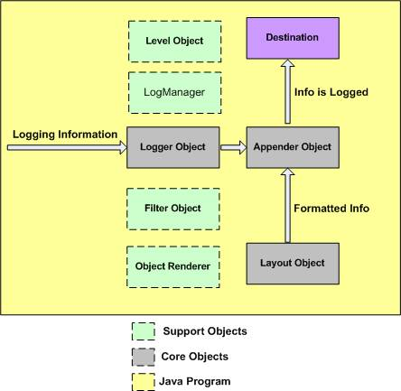

# 架构

log4j API 采用分层架构，每一层有不同的对象，完成不同的任务。这种分层架构让设计变得灵活，且易于日后扩展。

log4j 里有两种类型的对象：

- **核心对象**：这是框架必需的对象，使用框架时必需用到它们。
- **支持对象**：这是框架的可选对象，它们支持核心对象做一些额外的，但并不重要的任务。

## 核心对象

核心对象包括如下几种类型：

### Logger 对象

最上一层是 Logger 对象，该对象负责获取日志信息，并存储于一个分层的命名空间之中。

### Layout 对象

Layout 层提供了用于以各种风格格式化日志信息的对象，在发布日志信息之前，它为 appender 对象提供支持。

Layout 对象对于发布日志信息非常重要，它使日志变得可读、可复用。

### Appender 对象

该对象位于分层架构中的较低一层，Appender 对象负责将日志信息发布到不同目的地，比如数据库、文件、控制台、Unix Syslog 等。

下图展示了 log4j 框架中的组件：

## 支持对象

log4j 中还有其他一些对象，同样在框架中发挥着重要作用。

### Level 对象

Level 对象定义了日志信息的粒度和优先级。API 定义了七种级别：OFF、DEBUG、INFO、ERROR、WARN、FATAL、ALL。

### Filter 对象

Filter 对象用来分析日志信息，进而决定该条日志是否被记录。

一个 Appender 对象可对应多个 Filter 对象，当日志信息传给 Appender 对象时，与其关联的所有 Filter 对象需要判断是否将日志信息发布到目的地。

### ObjectRenderer

ObjectRenderer 对象负责为传入日志框架的不同对象提供字符串形式的表示，Layout 对象使用该对象来准备最终的日志信息。

### LogManager

LogManager 对象管理日志框架，它负责从系统级的配置文件或类中读取初始配置参数。